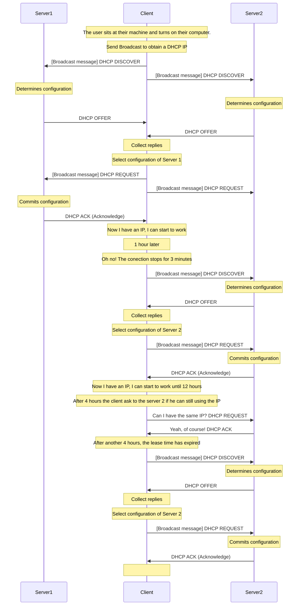

```mermaid

sequenceDiagram
    participant Server1
    participant Client
    participant Server2

    Note over Client: The user sits at their machine and turns on their computer. 
    Note over Client: Send Broadcast to obtain a DHCP IP

    Client->>Server1: [Broadcast message] DHCP DISCOVER
    Client->>Server2: [Broadcast message] DHCP DISCOVER

    Note over Server1: Determines configuration
    Note over Server2: Determines configuration

    Server1->>Client: DHCP OFFER
    Server2->>Client: DHCP OFFER

    Note over Client: Collect replies
    Note over Client: Select configuration of Server 1

    Client->>Server1: [Broadcast message] DHCP REQUEST
    Client->>Server2: [Broadcast message] DHCP REQUEST  

    Note over Server1: Commits configuration
    Server1->>Client: DHCP ACK (Acknowledge) 

    Note over Client: Now I have an IP, I can start to work
    Note over Client: 1 hour later
    Note over Client: Oh no! The conection stops for 3 minutes
    
    Client->>Server2: [Broadcast message] DHCP DISCOVER
    Note over Server2: Determines configuration
    Server2->>Client: DHCP OFFER
    Note over Client: Collect replies
    Note over Client: Select configuration of Server 2
    Client->>Server2: [Broadcast message] DHCP REQUEST
    Note over Server2: Commits configuration
    Server2->>Client: DHCP ACK (Acknowledge) 
    Note over Client: Now I have an IP, I can start to work until 12 hours

    Note over Client: After 4 hours the client ask to the server 2 if he can still using the IP
    Client->>Server2: Can I have the same IP? DHCP REQUEST
    Server2->>Client: Yeah, of course! DHCP ACK

    Note over Client: After another 4 hours, the lease time has expired
    Client->>Server2: [Broadcast message] DHCP DISCOVER
    Note over Server2: Determines configuration
    Server2->>Client: DHCP OFFER
    Note over Client: Collect replies
    Note over Client: Select configuration of Server 2
    Client->>Server2: [Broadcast message] DHCP REQUEST
    Note over Server2: Commits configuration
    Server2->>Client: DHCP ACK (Acknowledge) 

    Note over Client: 

```